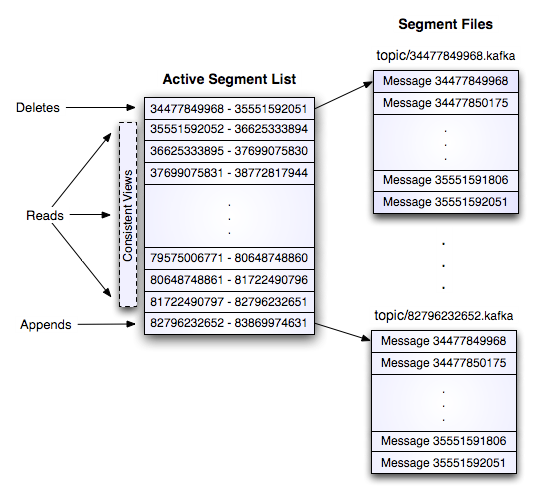
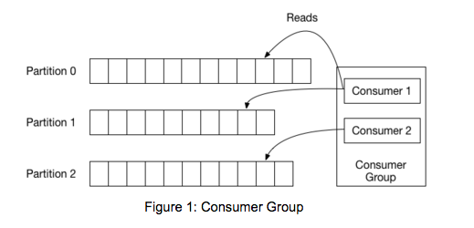
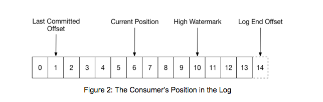

# (GitHub-Flavored) Markdown Editor

Basic useful feature list:

 * Ctrl+S / Cmd+S to save the file
 * Ctrl+Shift+S / Cmd+Shift+S to choose to save as Markdown or HTML
 * Drag and drop a file into here to load it
 * File contents are saved in the URL so you can share files

I'm no good at writing sample / filler text, so go write something yourself.

# Kafka Basics

Kafka is a combination of messaging, storage and stream processing based on a distributed append-only log. (fast, scalable, durable, fault-tolerant)

Kafka's design can be seen as a distributed commit log where incoming data is written to disk sequentially. 4 main components:
* Topics
* Producers
* Consumers
* Brokers

A stream of messages with a particular(user-defined) category is defined as a **Topic**. A message is a payload of bytes and can be published to a specific topic by a **Producer**. **Consumers** subscribe to topics and process the published messages. Published messages are replicated and persisted to a set of servers called **Brokers** forming a Kafka Cluster. Messages are retained by Kafka for a each topic:
* for a specific time (defaults to 7 days)
* for a specific total size of messages per partition
* based on message keys, storing only the most recent msg per key

## Topics/Partitions
Each topic is divided into a set of logs, known as *partitions*. Each partition is an ordered, immutable sequence of records, where each record is assigned a sequential id called the *offset* that uniquely identifies each record within the partition. 

Partitions allow topic parallelization by splitting the data of a specific topic across multiple brokers and allow the log to scale beyond a size that will fit on a single server. Additionally each partition is replicated across a configurable number of brokers for fault tolerance. Each partition can be placed on a separate node to allow for multiple consumers to read from a topic in parallel. Consumers can also be parallelized so that multiple consumers can read from multiple partitions in a topic, allowing high message throughput.

Another way to see a partition is as a log - each partition of a topic corresponds to a logical write-ahead log. Physically a log is implemented as a set of segment files of equal size.
When Kafka writes to a partition, it writes to a segment - the active segment. If the segment's size limit is reached, a new segment is opened and that becomes the new active segment.
Segments are named by their base offset. The base offset of a segment is an offset greater than offsets in previous segments and less than or equal to offsets in that segment.

On disk, a partition is a directory and each segment is an index file and a log file.
Each message is its value, offset, timestamp, key, message size, compression codec, checksum, and version of the message format.
The data format on disk is exactly the same as what the broker receives from the producer over the network and sends to its consumers. This allows Kafka to efficiently transfer data with [zero copy](https://www.ibm.com/developerworks/library/j-zerocopy/).

Each broker holds a number of partitions and each topic partition is replicated *n* times, where *n* is the replication factor of the topic. This allows Kafka to automatically failover to these replicas when a server in the cluster fails, so that partitions stay writeable and messages remain available. Out of the *n* replicas, one replica is designated as the *leader* for a partition, while the remaining replicas are *followers*.
All writes and reads for a partition are served through the leader. Partitions - as well as leadership - are balanced within a cluster in a round-robin fashion to have an evenly distributed load.

#### Replication
Kafka supports intra-cluster replication, which provides higher availability and durability. A partition can have multiple replicas, each stored on a different broker. One of the replicas is designated as the leader and the rest of the replicas are followers. Internally, Kafka manages all those replicas automatically and makes sure that they are kept in sync. Both the producer and the consumer requests to a partition are served on the leader replica. When a broker fails, partitions with a leader on that broker become temporarily unavailable. Kafka will automatically move the leader of those unavailable partitions to some other replicas to continue serving the client requests. This process is done by one of the Kafka brokers designated as the controller. It involves reading and writing some metadata for each affected partition in ZooKeeper. Currently, operations to ZooKeeper are done serially in the controller.

In the common case when a broker is shut down cleanly, the controller will proactively move the leaders off the shutting down broker one at a time. The moving of a single leader takes only a few milliseconds. So, from the clients perspective, there is only a small window of unavailability during a clean broker shutdown.

However, when a broker is shut down uncleanly (e.g., kill -9), the observed unavailability could be proportional to the number of partitions. Suppose that a broker has a total of 2000 partitions, each with 2 replicas. Roughly, this broker will be the leader for about 1000 partitions. When this broker fails uncleanly, all those 1000 partitions become unavailable at exactly the same time. Suppose that it takes 5 ms to elect a new leader for a single partition. It will take up to 5 seconds to elect the new leader for all 1000 partitions. So, for some partitions, their observed unavailability can be 5 seconds plus the time taken to detect the failure.

If one is unlucky, the failed broker may be the controller. In this case, the process of electing the new leaders won’t start until the controller fails over to a new broker. The controller failover happens automatically, but requires the new controller to read some metadata for every partition from ZooKeeper during initialization. For example, if there are 10,000 partitions in the Kafka cluster and initializing the metadata from ZooKeeper takes 2 ms per partition, this can add 20 more seconds to the unavailability window.

## Consumers
Kafka uses the concept of *consumer groups* to allow a pool of processes to divide the work of consuming and processing records. 

Kafka consumers configure the *consumer group* they belong to and can dynamically set the list of topics to subscribe to. Kafka will deliver each message in the subscribed topics to one process in each consumer group. This is achieved by balancing the partitions between all members in the group so that each partition gets assigned exactly to one consumer in the group. So, if there is a topic with four partitions, and a consumer group with 2 processes, each process will consume from 2 partitions. On the other side if you have more consumers than partitions some consumers will not get any data - meaning the number of partitions define the degree of parallelization.
Kafka only provides a total order over messages within a partition.(Total order can be achieved with a topic with one partition - but this also means only one consumer per consumer group).
The following picture from the Kafka documentation describes the situation with multiple partitions of a single topic. Server 1 holds partitions 0 and 3 and server 3 holds partitions 1 and 2. We have two consumer groups, A and B. A is made up of two consumers and B is made up of four consumers. Consumer Group A has two consumers of four partitions so each consumer reads from two partitions. Consumer Group B, on the other hand, has the same number of consumers as partitions and each consumer reads from exactly one partition.

Membership in a consumer group is handled dynamically. If a process fails, the partitions assigned to it, will be reassigned to other consumers in the same group. If a new consumer joins a groip, partitions will be moved from existing consumers to the new one. The same process is used when new partitzions are added to one of the subscribed topics: the group automatically dedects gthe change and rebalances so that every new partition is assigned to one of the members.
A consumer group can be thought of as being a single logical subscriber - made up of multiple processes and a topic's partitions are assigned to these processes in a way that each partition is consumed by exactly one consumer. By doiung this, Kafka ensures that the consumer is the only reader of that poartition and consumes data in order. 
A consumer group generalizes two messaging concepts: *queuing* and *publish-subscribe*. As with a queue with a consumer group one can divide up processing over a collection of processes(the members of the group) and as in publish-subscribe, Kafka allows to broadcast messages to multiple consumer groups.

Consumers track the maximum offset they have consumed in each partition and periodically commit the offset vector so that they can resume from those offsets in the event of a restart. This means that the position of a consumer in each partition is just a single integer, the offset of the next message to consume. This makes the state about what has been consumed very small, just one number for each partition.
The consumer uses a group coordination protocol built into Kafka itself. For each group, one of the brokers is selected as the group coordinator. The coordinator is responsible for managing the state of the group. Its main job is to mediate partition assignment when new members arrive, old members depart, and when topic metadata changes. The act of reassigning partitions is known as rebalancing the group.

When a group is first initialized, the consumers typically begin reading from either the earliest or latest offset in each partition. The messages in each partition log are then read sequentially. As the consumer makes progress, it commits the offsets of messages it has successfully processed, e.g.: in the figure below, the consumer’s position is at offset 6 and its last committed offset is at offset 1.

When a partition gets reassigned to another consumer in the group, the initial position is set to the last committed offset. If the consumer in the example above suddenly crashed, then the group member taking over the partition would begin consumption from offset 1. In that case, it would have to reprocess the messages up to the crashed consumer’s position of 6.

The diagram also shows two other significant positions in the log. The log end offset is the offset of the last message written to the log. The high watermark is the offset of the last message that was successfully copied to all of the log’s replicas. From the perspective of the consumer, the main thing to know is that you can only read up to the high watermark. This prevents the consumer from reading unreplicated data which could later be lost.

## Zookeeper
Zookeeper is a distributed, hierarchical file system that facilitates loose coupling between clients and is organized around *znodes*(which are like files and directories). It provides an event-driven model in which clients can watch for znode changes(e.g.: a new child is added to a znode). Zookeeber is high available by running multiple instances within a Zookeeper *ensemble*, where each server holds an in-memory copy of the distributed file system. A typical Zookeeper ensemble exists of a master plus an arbitrary number of followers(an uneven nr is recommended as Zookeeper is majority quorum based).
All write requests are routed through the leader and broadcasted to all followers. Kafka uses Zookeeper for 
* managing Cluster membership - which brokers are alive and part of the cluster.
* topic config - which topics exist, how many partitions per topic, where are the replicas...
* managing quotas - how much data is each client allowed to write/read
* managing ACL's - which client is allowed to read and write to which topic

